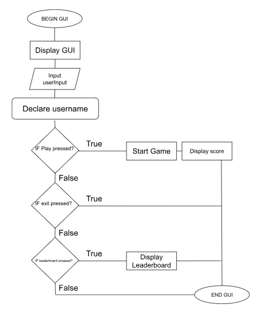
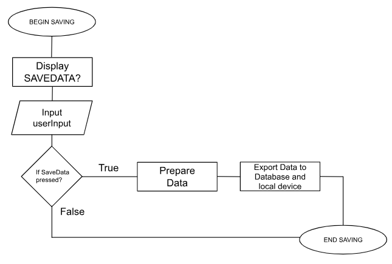
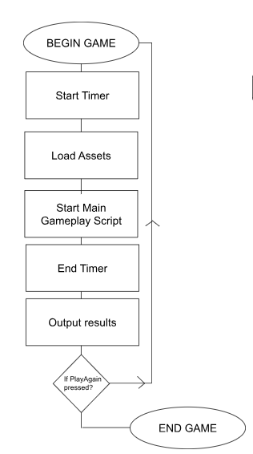
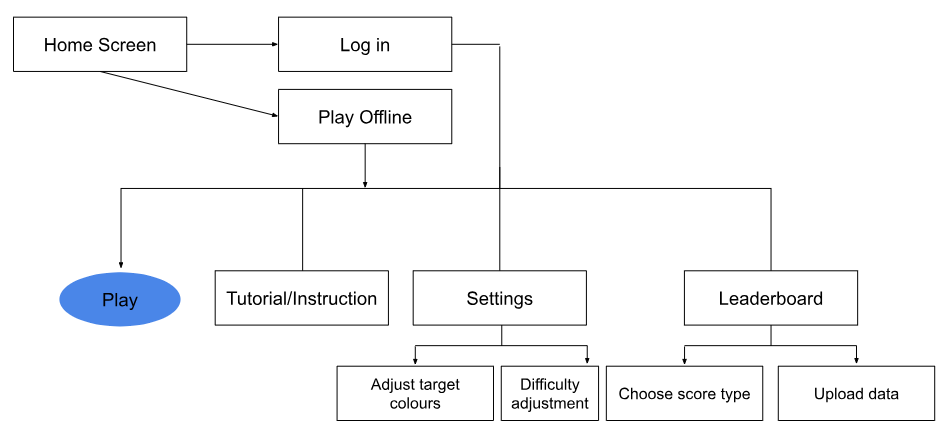
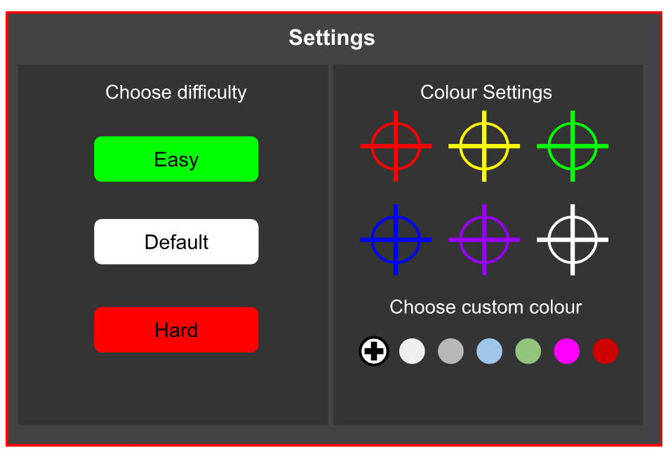
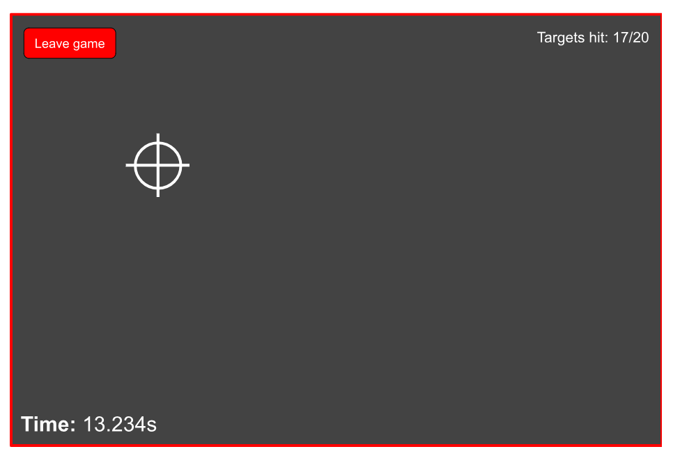
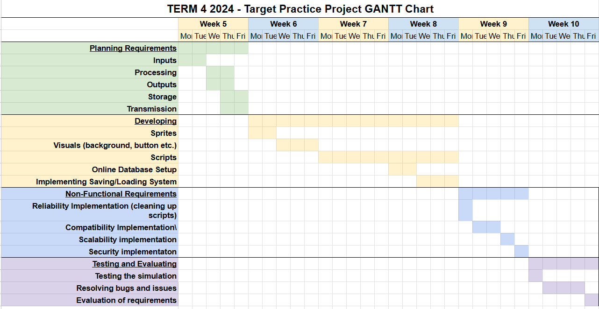

# **Ray Wong's Developer Folio**
## **Identifying a need**
### Brainstorming Table
| Unity | Python | Other |
|-------|:------:|------:|
| Mario x Minecraft Platformer | Text-based RPG | Red Light Green light with EV3 |
| 3D Chess | Text-based chess | Rock-Paper-Scissors with EV3
| Extension of **Snow Hunt** | Reaction time target practice | - |
### **Need:** To improve visual reflexes, hand-eye coordination and accuracy through a fast-paced simulation, specifically for gamers (especially for FPS players).
### **Problem Statement:** In many video games, they require excellent skills to score as high as possible, requiring extensive experience in the field of hand-eye coordination and visual reflexes. Shooter games, such as Counter-strike and Valorant, require expert timing and precision, as well as combat games such as Minecraft (1.8 PVP specific), also require quick reaction time and accuracy.
### **Skill Development:** I will follow PyGame tutorials and various python cheatsheets as listed below: 

- https://www.youtube.com/watch?v=y9VG3Pztok8
- https://medium.com/@amit25173/pygame-cheat-sheet-311cfc7b6ce8
- https://www.youtube.com/watch?v=FfWpgLFMI7w

## **Requirements**
### **Inputs**
- #### Mouse clicks
- #### Keyboard input
### **Processing**
- #### System receives the input from the user
- #### Based on the input, the system will go to the section of programming specific to the input and prepare it for the output (e.g. user clicks on target, system updates score and prepares the next targets random location)
### **Outputs**
- #### Targets
- #### Quit/Start button
- #### Numerical Score
- #### GUI for game preferences
### **Transmission**
- #### The system may require an internet connection if the user decides to allow their score to be published on an online database (leaderboard). 
### **Storage**
- #### The system will store the player's previous game settings and score.

## **Functional Requirements**
### **User Interaction**
- #### **Interaction:** The user needs requires a mouse and keyboard to play. 
- #### **Actions:** The user will be able to type in a username, interact with a GUI, view an online leaderboard and click on randomly appearing targets.
- #### **Actions and result:** When the user types in their desired username, it will be their registered name in the online database (if consent is given). The GUI responds to the location of the mouse click and executes code (e.g. clicking the start button will result in the system starting the simulation). When a target is clicked, the system responds by generating a random location on the screen, of which the next target will appear.
### **Saving and loading data**
- #### **Storing the data:** The users game data (username, score, average reaction time etc.) will be placed onto an online database.
### **Core Mechanics**
- #### **List:** The core mechanics will include the starting GUI, a timer that calculates the score (2 scores: a general score and a score that measures milliseconds), main gameplay of the target practice, and a feedback output (score, average time etc.)
- #### **Step-by-step flow:** Starting Screen (GUI) -> Detect input to start -> Start timer -> Main Gameplay -> Output results 
### **Saving data**
- #### **Saving and loading** The user can decide if they want to save/load their user data. This includes their previous scores, username and personal preferences. It will be stored on the **users device**.

## **Non-functional requirements**
### **Performance Requirements**
- #### The system should run processes instantly, including the GUI, main gameplay and calculating scores. A loading screen may be required if processes take longer than a second (especially the GUI). Running the initial program may take longer, but is acceptable if it only takes a few seconds.
### **Usability Requirements**
- #### To make the user experience as smooth as possible, an easy-to-navigate GUI will be included, as well as a text-based tutorial on how to play the simulation.
### **Compatibility Requirements**
- #### As this program is specifically for computer video games, it will only run on PC. It may run on iOS devices, but only for Mac devices. As FPS games are usually played on PC devices, it will not be optimised for tablets and phones.
### **Scalability Requirements**
- #### The game could be expanded into a 3D target practice simulation, ensuring performance is not impacted. Expanding into 3D will make the transition between FPS games and this simulation more seamless.
### **Security Requirements**
- #### Only necessary information (score and username) will be published publicly. Login information will only be stored on the device. Any other data will be encrypted and stored safely, only giving access to authorised users.
### **Reliability and Availability**
- #### The system will be available all the time to those who doanload the software on their device. Even though it has an online leaderboard, it will still be playable offline. To prevent any data loss from crashes or failures, the user's data will be backed up regularly on their device, and the online leaderboard's database will be backed up regularly (every 24 hours).
## **Consideration of Social and Ethical Issues**
### **Definition of Equity and Accessibility**
#### **Equity**
##### Equity defines airness and justice. It differentiates from equality, which refers to all individuals and groups maintaining the exact same resources, while equity considers everyone's different circumstances. 
#### **Accessibility**
##### Accessibility defines the quality of being able to be reached or used easily.
### **Analysis of Issues**
#### **Accessibility**
##### To cater for people who have a disability, the game will be playable from a controller as well. if someone is colorblind, they will be able to customise target colours in the GUI, ensuring they are able to play fairly. They can also customise their controls, in case anyone has motor issues.
#### **Privacy and Data Protection**
##### This project collects user data in a responsible manner. To maintain data and privacy protection, the game will ask the user for their consent before proceeding with collecting their data. It will be stored in a secure database where only admins and authorised users are able to access it. 
#### **Fairness and Representation**
##### The simulation will not present any stereotypical or biased point of view. There will not be any biased ideas of culture, gender or race. All themes in the simulation will be presented in generic and universal terms, including colours, appearance of sprites and more.
#### **Mental and Emotional Well-being**
##### The project will provide the best possible user experience. Graphics will be simple and generic, and there will be minimal sudden flashing to prevent epilepsy seizures.
#### **Cultural Sensitivities**
##### Graphics in the games will be kept as a generic appearance. The presence of cultural values and symbols will not be included, to ensure no misunderstanding from people with different backgrounds.

## **Researching and Planning**
### PMIs
| **Existing Idea** | **Plus** | **Minus** | **Implication** |
|-------------------|----------|-----------|-----------------|
| Aim Lab | Aim Lab is an aim trainer based on 3D gameplay, which improves how applicable it is to normal FPS games. It also features different modes, including switching between first-person and third-person. The graphics are also very well implemented, with plenty of colours. | This game may not be applicable to non-FPS games (such as Minecraft), because its main focus is on FPS games. Also, it doesn't include a 2D mode. | Based on the plus and minuses, I will consider adding a 3D mode to the game to better optimise towards those playing 3D FPS games. However, I will avoid detailed graphics, in order to make my game as accessible as possible to less-optimised devices and different people. | 
| Kovaak's | Kovaak's is another aim trainer, similar to Aim Lab. It features a plethora of different game scenarios, better optimising the player who is improving their gameplay. It features colourful but generic graphics. Because of the variety the game has, it is useful for both beginners and advanced players. | While Kovaak's has a plethora of game scenarios, not all of them are fully applicable to real FPS games. These scerios may seem useless to some players. | Considering the plus and minuses, I will consider adding more customisable options to my game (random target timing, moving targets, multiple targets etc.). |
| Osu | The rhythmic nature of Osu encourages players to train their visual reflexes while clicking/dragging on-screen notes. In addition, Osu also has additional gamemodes where the player uses their keyboard, allowing them to also train their keyboard and screen coordination. | While Osu improves hand-eye coordination, it may not correlate directly to FPS games. Its focus on music-based rhythm gameplay also can't be applied very well to FPS games. | Based on the points made, I will consider adding a keyboard mode. Using the mouse asnd keyboard, the player will be able to use a certain keybind to destroy the target while hovering their mouse over it. |

### Flowchart/Pseudocode
#### **User Interaction**
#### Flowchart

#### Pseudocode
    BEGIN GUI

    DISPLAY GUI

    INPUT username

    DECLARE username

    IF Play pressed?
        THEN
            START GAME
            DISPLAY score
        ELSE IF exit pressed?
            THEN
                DISPLAY Leaderboard
        ELSE IF leaderboard pressed?
            THEN
                END GUI
        ELSE
            END GUI
    ENDIF 

    END GUI
#### **Save Data**
#### Flowchart

#### Pseudocode
    BEGIN SAVING

    DISPLAY SAVEDATA?

    INPUT userInput

    IF SaveData pressed?
        THEN
            Prepare Data
            Export Data to Database and local device
        ELSE
            END SAVING
    ENDIF 

    END SAVING
#### **Gameplay**
#### Flowchart

#### Pseudocode
    BEGIN GAME

    Start Timer

    Load Assets

    Start Main Gameplay Script

    End Timer

    Output results

    IF PlayAgain pressed?
        THEN
            BEGIN GAME
        ELSE
            END GAME
        ENDIF 

    END GAME
### Storyboards
#### **Screen: Full Game**
#### Storyboard

#### Inventory
| Assets | Scripts |
| ------ | ------- |
| Background image | Login System |
| Settings button  | Settings interface script |
| Play button      | Leaderboard interface script |
| Leaderboard button | Data uploading/downloading system |
| Leaderboard design | Play Script
| Target sprites (for colours)
| Difficulty buttons |
| Settings design |
#### **Screen: Settings**
#### Storyboard

#### Inventory
| Assets | Scripts |
| ------ | ------- |
| Settings interface | Settings interface script |
| Change colour buttons | Colour change interface script |
| Difficulty buttons | Difficulty selection interface script | 
| Custom colour button | Custom colour picker system |
#### **Screen: Leaderboard** 
#### Storyboard

#### Inventory
| Assets | Scripts |
| ------ | ------- |
| Leaderboard interface | Leaderboard interface script |
| Difficulty option buttons | Diffculty and type of data to display script |
| Type of data to show button | Upload system (to cloud)
| Upload data prompt |
| Disclaimer text/screen |
#### **Screen: Gameplay**
#### Storyboard 

#### Inventory
| Assets | Script |
| ------ | ------ |
| Gameplay background | Gameplay script |
| Ready Set Go Screen | Score calculation script
| Target sprite | Timer script |
| Timer interface |
| Target interface |
| Leave game button |
### GANTT Chart
